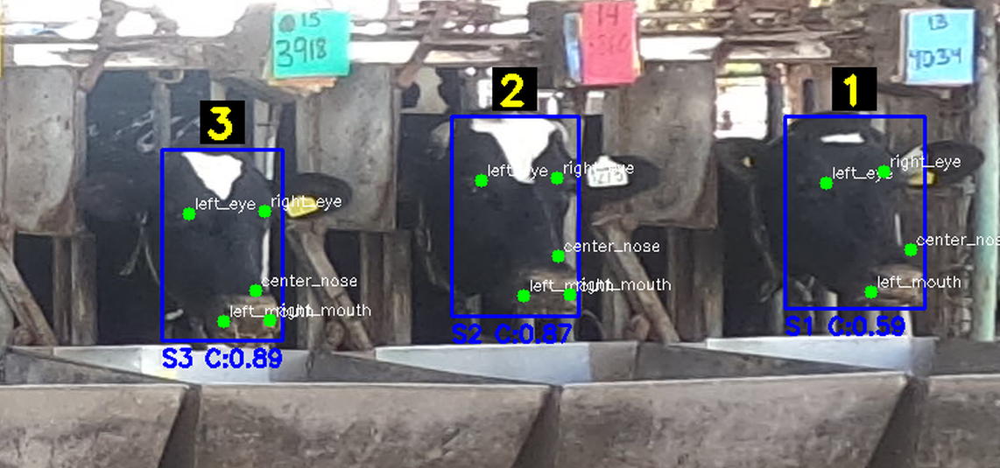

# Cow Pose / Station Detection

Overview
--------
A compact, production-oriented toolkit for detecting cow face bounding boxes and five facial keypoints, assigning detections to fixed station regions and producing tabular exports. Built around Ultralytics YOLOv8 (pose models), OpenCV for visualization and image processing, and small Tkinter GUIs and CLI tools for fast iteration.

Quick summary
-------------
- Detect cow faces and 5 keypoints: left_eye, right_eye, center_nose, left_mouth, right_mouth.
- Assign detections to fixed "station" bounding boxes (CSV-driven) with configurable margin.
- Batch inference with multiprocessing and CSV export.
- Interactive GUIs for manual inspection, targeted relabeling and lighting-augmented deep search.
- Simple annotator that supports model-assisted continuous labeling and fine-tuning.

What is included
-----------------
- Training: train.py, train_fine_tuning.py, train_stronger_model.py
- Batch inference / export: Cow_location_extractor*.py (CLI and variants)
- GUIs:
  - myprog_with_cow_num.py — visual inspector with station-number overlay and lighting presets
  - myProg5-deep_search_colors.py — deep-aggregate detection across many image-effects
  - my_auto_labeling_with_change_option.py — model-assisted annotator for iterative labeling and keypoint editing
- Configs: data.yaml, data_for_fine_tuned.yaml (keypoint names & shapes, dataset paths)
- Station coordinates: COW_STATION_LOCATIONS_PART1.csv (CSV with station bboxes)
- Pretrained/offline weights: yolov8{n,m,l}-pose.pt and runs/pose/* fine-tuned weights

Requirements
------------
Minimum (example):
- Python 3.10+
- ultralytics
- torch (install correct CUDA build for GPU)
- opencv-python
- numpy
- pandas
- pillow
- tqdm
- tkinter (usually included with Python on Windows)

Create a requirements.txt (suggested):
- ultralytics
- torch
- opencv-python
- numpy
- pandas
- pillow
- tqdm

Quick start
-----------
1) Install dependencies (virtualenv recommended):
   pip install -r requirements.txt

2) Train / fine-tune:
   - baseline (pose model): python train.py
   - fine-tune existing best.pt: python train_fine_tuning.py
   - heavier model for improved accuracy: python train_stronger_model.py

3) Run batch extraction (CSV):
   python Cow_location_extractor_cli.py
   - the script interactively prompts for: station CSV, model (.pt) and images folder.

4) Visual inspection and manual corrections:
   - Launch inspector GUI: python myprog_with_cow_num.py
   - Use deep-aggregate scan: python myProg5-deep_search_colors.py
   - For active annotation/editing: python my_auto_labeling_with_change_option.py

Model-assisted continuous labeling (recommended workflow)
-------------------------------------------------------
This project is set up for iterative annotation when you have a rudimentary model and want to scale labeling with minimal manual effort.

1) Bootstrap labels
   - Start by labeling a small representative subset manually (use my_auto_labeling_with_change_option.py). Save outputs to the "labels/" folder in YOLOv8 pose format.

2) Train / fine-tune
   - Fine-tune a pose model on the initial labeled set (train_fine_tuning.py). This will produce a starting .pt with reasonable recall for the target environment.

3) Model-assisted relabeling (continuous loop)
   - Run the annotator (my_auto_labeling_with_change_option.py) and configure it to run the model on unlabeled images. The annotator will:
     - Pre-fill bounding boxes and keypoints using the model
     - Allow quick manual corrections (drag keypoints, redraw bbox) and save in YOLO pose label format
   - Use the inspector GUIs to quickly audit batches and run deep-aggregate searches (lighting effects) to find missed detections.

4) Re-train on augmented dataset
   - Add corrected / new labels to the training set and fine-tune again. Repeat until performance meets requirements.

Notes on my_auto_labeling_with_change_option.py
-----------------------------------------------
- Purpose: fast interactive annotator that uses a trained YOLOv8 pose model to prepopulate detections and lets the user correct or add keypoints and bboxes.
- Save format: YOLOv8 pose label format — compatible with data.yaml and training scripts.
- UX pointers:
  - Use manual mode to add or correct bboxes and keypoints when detections are missing or wrong.
  - Use keypoint drag to fix inaccurate keypoints rather than re-labeling from scratch.
  - Exported labels are ready for immediate re-training or fine-tuning.

Station assignment & post-processing
------------------------------------
- Stations are defined in a CSV containing label_name, bbox_x, bbox_y, bbox_width, bbox_height.
- Assignment logic uses detection center + configurable margin; adjust margin in code where needed.
- Batch extractor outputs a CSV with: image_name, station_number, face bbox xyxy and the five keypoint coords.

Tips for production-like runs
----------------------------
- Use GPU for training and inference (set device='cuda' in scripts). The CLI limits worker count when using CUDA to avoid contention.
- Increase imgsz for higher-resolution input when small keypoints are missed (scripts set a threshold to auto-increase imgsz for large images).
- Tune conf/iou trade-off: lower conf finds more candidates; use deep-aggregate + NMS filtering to recover low-confidence true positives.
- For memory-limited machines, use yolov8n/s variants or reduce batch size / workers.

Examples
--------
- Run inference on images in folder and save CSV:
  python Cow_location_extractor_cli.py

- Visual inspection and deep search (GUI):
  python myProg5-deep_search_colors.py

- Start the annotator and export labels for training:
  python my_auto_labeling_with_change_option.py

Large-scale runs & research use
------------------------------

- Cow_location_extractor_cli.py is designed for large-batch processing and can be tuned for very large datasets. It has been used to process ~600,000 images in a single project, exporting per-folder CSV files with one row per detected cow.
- Each image is expected to contain up to 12 cows (one per station in the monitored setup). The extractor assigns detections to stations and writes: image_name, station_number, face bbox (xyxy) and the five keypoint coordinates.
- Hardware notes: the extractor supports multiprocessing and will fall back to CPU if CUDA is unavailable; when using GPU, limit worker count to avoid contention (the CLI defaults to one GPU worker).
- Data sharing policy: trained weights, raw CSV exports and downstream analysis produced within an institutional research project ( Volcani Center ) are not included in this repository.

Saved CSV structure
-------------------
The extractor outputs CSV files where each row corresponds to a single detected cow. The columns are listed below (shown as they appear in the CSV header):

| image_name | station_number | cow_face_x1 | cow_face_y1 | cow_face_x2 | cow_face_y2 | left_eye_x | left_eye_y | right_eye_x | right_eye_y | center_nose_x | center_nose_y | left_mouth_x | left_mouth_y | right_mouth_x | right_mouth_y |
|---|---:|---:|---:|---:|---:|---:|---:|---:|---:|---:|---:|---:|---:|---:|---:|
| filename (string) | station id (int) | bbox x1 (int) | bbox y1 (int) | bbox x2 (int) | bbox y2 (int) | left eye x (int or empty) | left eye y (int or empty) | right eye x (int or empty) | right eye y (int or empty) | nose x (int or empty) | nose y (int or empty) | left mouth x (int or empty) | left mouth y (int or empty) | right mouth x (int or empty) | right mouth y (int or empty) |

Example CSV header (tab/CSV-compatible):

image_name	station_number	cow_face_x1	cow_face_y1	cow_face_x2	cow_face_y2	left_eye_x	left_eye_y	right_eye_x	right_eye_y	center_nose_x	center_nose_y	left_mouth_x	left_mouth_y	right_mouth_x	right_mouth_y

Repository maintenance
----------------------
- Keep best weights under runs/pose/ and update MODEL_PATH constants in GUI scripts to point to current best.pt
- Regenerate station CSV if camera mounting or barn layout changes
- Commit small labeled batches frequently to track data drift during continuous labeling

Troubleshooting
---------------
- Model load errors: ensure ultralytics and torch versions are compatible and .pt path is correct.
- No detections: model must be trained for "pose" (check kpt_shape and kpt_names in data.yaml).
- Slow inference / OOM errors: switch to smaller model, lower imgsz, reduce workers.

